# BỔ SUNG TÀI LIỆU - CHUẨN HÓA CHƯƠNG 3 & 4

## CHƯƠNG 3: THIẾT KẾ HỆ THỐNG

### 3.2 Use Case Diagram

#### Actors:
1. **Customer** (Khách hàng)
2. **Partner** (Chủ nhà hàng)
3. **Admin** (Quản trị viên)
4. **System** (Hệ thống - actor phụ)

#### Use Cases chi tiết:

**CUSTOMER Use Cases:**
```
UC01: Đăng ký tài khoản
  - Actor: Customer
  - Precondition: Chưa có tài khoản
  - Main Flow:
    1. Customer nhập phone_number, password, full_name, email
    2. System validate dữ liệu
    3. System tạo User với role=CUSTOMER
    4. System tạo Customer record
    5. System trả về JWT token
  - Postcondition: Customer được tạo thành công

UC02: Đăng nhập
  - Actor: Customer, Partner, Admin
  - Main Flow:
    1. User nhập phone_number, password
    2. System xác thực
    3. System trả về JWT token
  - Alternative Flow: Sai mật khẩu → hiển thị lỗi

UC03: Tìm kiếm nhà hàng
  - Actor: Customer
  - Precondition: Không cần đăng nhập
  - Main Flow:
    1. Customer nhập location, keyword
    2. System filter restaurants theo location_id
    3. System trả về danh sách restaurants với status=APPROVED
  - Postcondition: Hiển thị danh sách nhà hàng

UC04: Xem chi tiết nhà hàng
  - Actor: Customer
  - Include: UC04.1 (Xem menu), UC04.2 (Xem ảnh), UC04.3 (Xem time slots)
  - Main Flow:
    1. Customer chọn restaurant
    2. System load restaurant details
    3. System load related images, menu_items, time_slots
  - Postcondition: Hiển thị đầy đủ thông tin

UC05: Đặt bàn
  - Actor: Customer
  - Precondition: Customer đã đăng nhập, Restaurant status=APPROVED
  - Main Flow:
    1. Customer chọn restaurant, date, time_slot, number_of_guests
    2. System check time_slot availability
    3. System tạo Booking với status=PENDING
    4. System gửi notification cho Partner
  - Alternative Flow: 
    - Slot full → hiển thị lỗi "Đã hết chỗ"
    - Đặt quá khứ → hiển thị lỗi "Không thể đặt quá khứ"
  - Postcondition: Booking được tạo

UC06: Xem lịch sử đặt bàn
  - Actor: Customer
  - Main Flow:
    1. Customer vào trang "Booking của tôi"
    2. System load bookings where customer_id = current_user
    3. System trả về danh sách bookings với thông tin restaurant, time_slot
  - Postcondition: Hiển thị danh sách bookings

UC07: Hủy đặt bàn
  - Actor: Customer
  - Precondition: Booking status = PENDING hoặc CONFIRMED
  - Main Flow:
    1. Customer chọn booking cần hủy
    2. System update booking.status = CANCELLED
    3. System gửi notification cho Partner
  - Alternative Flow: Booking đã COMPLETED/NO_SHOW → không cho hủy
  - Postcondition: Booking bị hủy

UC08: Cập nhật profile
  - Actor: Customer, Partner
  - Main Flow:
    1. User vào trang Profile
    2. User sửa full_name, email, date_of_birth, address
    3. System validate và update
  - Postcondition: Profile được cập nhật
```

**PARTNER Use Cases:**
```
UC09: Đăng ký Partner
  - Actor: Partner
  - Main Flow:
    1. Partner nhập phone, password, full_name, email, business_name, business_license, tax_code
    2. System tạo User với role=PARTNER
    3. System tạo Partner với status=PENDING
    4. System gửi notification cho Admin
  - Postcondition: Partner chờ duyệt

UC10: Tạo nhà hàng
  - Actor: Partner
  - Precondition: Partner status=ACTIVE
  - Main Flow:
    1. Partner nhập thông tin restaurant
    2. System tạo Restaurant với status=PENDING
    3. System gửi notification cho Admin
  - Postcondition: Restaurant chờ duyệt

UC11: Quản lý menu
  - Actor: Partner
  - Sub-use cases: UC11.1 (Thêm món), UC11.2 (Sửa món), UC11.3 (Xóa món)
  - Main Flow:
    1. Partner vào trang quản lý menu
    2. Partner thêm/sửa/xóa menu_item
    3. System cập nhật database
  - Postcondition: Menu được cập nhật

UC12: Quản lý time slots
  - Actor: Partner
  - Main Flow:
    1. Partner tạo time_slot (start_time, end_time, max_bookings)
    2. System validate (start < end, không trùng lặp)
    3. System lưu time_slot
  - Postcondition: Time slots được tạo

UC13: Xem bookings của nhà hàng
  - Actor: Partner
  - Main Flow:
    1. Partner chọn restaurant
    2. System load bookings where restaurant_id = selected_restaurant
    3. System group by date và time_slot
  - Postcondition: Hiển thị danh sách bookings

UC14: Xác nhận/Từ chối booking
  - Actor: Partner
  - Precondition: Booking status=PENDING
  - Main Flow:
    1. Partner chọn booking
    2. Partner click Confirm/Reject
    3. System update booking.status = CONFIRMED/REJECTED
    4. System gửi notification cho Customer
  - Postcondition: Booking được xử lý

UC15: Đánh dấu hoàn thành/No-show
  - Actor: Partner
  - Precondition: Booking status=CONFIRMED, booking_date <= today
  - Main Flow:
    1. Partner chọn booking
    2. Partner click Complete/No-show
    3. System update booking.status = COMPLETED/NO_SHOW
    4. If COMPLETED: System cộng customer.total_bookings += 1
  - Postcondition: Booking kết thúc
```

**ADMIN Use Cases:**
```
UC16: Duyệt Partner
  - Actor: Admin
  - Main Flow:
    1. Admin xem danh sách partners với status=PENDING
    2. Admin click Approve/Reject
    3. System update partner.status = ACTIVE/SUSPENDED
    4. System gửi notification cho Partner
  - Postcondition: Partner được duyệt

UC17: Duyệt Restaurant
  - Actor: Admin
  - Main Flow:
    1. Admin xem danh sách restaurants với status=PENDING
    2. Admin click Approve/Reject
    3. System update restaurant.status = APPROVED/SUSPENDED
    4. System gửi notification cho Partner
  - Postcondition: Restaurant được duyệt

UC18: Xem thống kê
  - Actor: Admin
  - Main Flow:
    1. Admin vào dashboard
    2. System tính toán:
       - Tổng users, partners, restaurants, bookings
       - Bookings theo ngày/tháng
       - Top restaurants
    3. System hiển thị biểu đồ
  - Postcondition: Hiển thị thống kê

UC19: Quản lý locations
  - Actor: Admin
  - Main Flow:
    1. Admin thêm/sửa/xóa location (city, district, ward)
    2. System cập nhật database
  - Postcondition: Locations được cập nhật
```

#### Use Case Diagram (Mermaid syntax):

```mermaid
graph TB
    Customer((Customer))
    Partner((Partner))
    Admin((Admin))
    System((System))
    
    Customer --> UC01[Đăng ký]
    Customer --> UC02[Đăng nhập]
    Customer --> UC03[Tìm nhà hàng]
    Customer --> UC04[Xem chi tiết]
    Customer --> UC05[Đặt bàn]
    Customer --> UC06[Xem lịch sử]
    Customer --> UC07[Hủy booking]
    Customer --> UC08[Cập nhật profile]
    
    Partner --> UC02
    Partner --> UC09[Đăng ký Partner]
    Partner --> UC10[Tạo nhà hàng]
    Partner --> UC11[Quản lý menu]
    Partner --> UC12[Quản lý time slots]
    Partner --> UC13[Xem bookings]
    Partner --> UC14[Xác nhận booking]
    Partner --> UC15[Đánh dấu hoàn thành]
    Partner --> UC08
    
    Admin --> UC02
    Admin --> UC16[Duyệt Partner]
    Admin --> UC17[Duyệt Restaurant]
    Admin --> UC18[Xem thống kê]
    Admin --> UC19[Quản lý locations]
    
    UC05 -.include.-> System
    UC14 -.include.-> System
```


---

### 3.3 Mô hình hóa đối tượng với UML (Class Diagram)

**ĐÃ CÓ TRONG TÀI LIỆU CHÍNH** - Xem phần "Sơ đồ lớp"

Các lớp chính:
- User (id, phone_number, full_name, role...)
- Customer (user_id, date_of_birth, address, loyalty_points...)
- Partner (user_id, business_name, status...)
- Restaurant (id, partner_id, name, location_id...)
- TimeSlot (id, restaurant_id, start_time, end_time, max_bookings...)
- Booking (id, customer_id, restaurant_id, time_slot_id, status...)
- Notification (id, user_id, title, message...)

Quan hệ:
- User 1---0..1 Customer (OneToOne)
- User 1---0..1 Partner (OneToOne)
- Partner 1---* Restaurant
- Restaurant *---1 Location
- Restaurant 1---* TimeSlot
- Restaurant 1---* Booking
- User 1---* Booking
- TimeSlot 1---* Booking

---

### 3.4 Mô hình động (Sequence Diagram & Activity Diagram)

#### 3.4.1 Sequence Diagram: Customer đặt bàn

```
Customer -> Frontend: Chọn nhà hàng, ngày, giờ
Frontend -> Backend: POST /api/bookings/
Backend -> Database: SELECT time_slot WHERE id=?
Database -> Backend: time_slot data
Backend -> Database: COUNT bookings WHERE time_slot_id=? AND date=? AND status NOT IN (CANCELLED, REJECTED)
Database -> Backend: current_booking_count
Backend -> Backend: Check: current_count < max_bookings?
alt Còn chỗ
    Backend -> Database: INSERT INTO bookings
    Database -> Backend: booking_id
    Backend -> Database: INSERT INTO notifications (partner)
    Backend -> Frontend: 201 Created {booking_id, status: PENDING}
    Frontend -> Customer: "Đặt bàn thành công"
else Hết chỗ
    Backend -> Frontend: 400 Bad Request "Đã hết chỗ"
    Frontend -> Customer: "Khung giờ này đã đầy"
end
```

#### 3.4.2 Sequence Diagram: Partner xác nhận booking

```
Partner -> Frontend: Click "Xác nhận"
Frontend -> Backend: PUT /api/bookings/{id}/confirm/
Backend -> Database: SELECT booking WHERE id=?
Database -> Backend: booking data
Backend -> Backend: Check: status == PENDING?
alt Status hợp lệ
    Backend -> Database: UPDATE bookings SET status=CONFIRMED, confirmed_at=NOW()
    Database -> Backend: success
    Backend -> Database: INSERT INTO notifications (customer)
    Database -> Backend: notification_id
    Backend -> Frontend: 200 OK {message: "Đã xác nhận"}
    Frontend -> Partner: "Xác nhận thành công"
else Status không hợp lệ
    Backend -> Frontend: 400 Bad Request "Booking đã được xử lý"
    Frontend -> Partner: "Không thể xác nhận"
end
```

#### 3.4.3 Activity Diagram: Luồng đăng ký Partner

```
Start
  ↓
[Partner nhập thông tin]
  ↓
[Frontend validate form]
  ↓
<Valid?> ---No--> [Hiển thị lỗi] --> [Partner nhập thông tin]
  |
 Yes
  ↓
[POST /api/accounts/register/partner/]
  ↓
[Backend check phone_number exists?]
  ↓
<Exists?> ---Yes--> [Return 400 "SĐT đã tồn tại"] --> End
  |
 No
  ↓
[Backend create User (role=PARTNER)]
  ↓
[Backend create Partner (status=PENDING)]
  ↓
[Backend generate JWT token]
  ↓
[Backend send notification to Admin]
  ↓
[Return 201 + token]
  ↓
[Frontend save token to localStorage]
  ↓
[Redirect to Partner Dashboard]
  ↓
End
```

#### 3.4.4 Activity Diagram: Luồng Customer hủy booking

```
Start
  ↓
[Customer vào "Đơn của tôi"]
  ↓
[GET /api/bookings/]
  ↓
[Hiển thị danh sách bookings]
  ↓
[Customer chọn booking cần hủy]
  ↓
<Status == PENDING or CONFIRMED?> ---No--> [Hiển thị "Không thể hủy"] --> End
  |
 Yes
  ↓
[Customer click "Hủy đơn"]
  ↓
[Frontend hiển thị confirm dialog]
  ↓
<Customer confirm?> ---No--> End
  |
 Yes
  ↓
[PUT /api/bookings/{id}/cancel/]
  ↓
[Backend update status=CANCELLED]
  ↓
[Backend send notification to Partner]
  ↓
[Return 200 "Đã hủy thành công"]
  ↓
[Frontend refresh booking list]
  ↓
[Hiển thị thông báo thành công]
  ↓
End
```

---

## CHƯƠNG 4: THIẾT KẾ DỮ LIỆU VÀ DÒNG DỮ LIỆU

### 4.1 Thiết kế ERD (Entity Relationship Diagram)

**ĐÃ CÓ TRONG TÀI LIỆU CHÍNH** - Xem phần "Cấu trúc Database"

#### Entities (11 bảng):
1. **users** - Thông tin người dùng chung
2. **customers** - Thông tin khách hàng
3. **partners** - Thông tin đối tác
4. **locations** - Địa điểm
5. **restaurants** - Nhà hàng
6. **time_slots** - Khung giờ đặt bàn
7. **restaurant_images** - Ảnh nhà hàng
8. **menu_items** - Món ăn
9. **bookings** - Đơn đặt bàn
10. **notifications** - Thông báo

#### Relationships:
- users (1) - (0..1) customers (OneToOne)
- users (1) - (0..1) partners (OneToOne)
- partners (1) - (*) restaurants (OneToMany)
- restaurants (*) - (1) locations (ManyToOne)
- restaurants (1) - (*) time_slots (OneToMany)
- restaurants (1) - (*) restaurant_images (OneToMany)
- restaurants (1) - (*) menu_items (OneToMany)
- restaurants (1) - (*) bookings (OneToMany)
- users (1) - (*) bookings (OneToMany)
- time_slots (1) - (*) bookings (OneToMany)
- users (1) - (*) notifications (OneToMany)

#### Cardinality chi tiết:
```
users ||--o| customers : "has"
users ||--o| partners : "has"
partners ||--o{ restaurants : "owns"
locations ||--o{ restaurants : "located in"
restaurants ||--o{ time_slots : "has"
restaurants ||--o{ restaurant_images : "has"
restaurants ||--o{ menu_items : "has"
restaurants ||--o{ bookings : "receives"
users ||--o{ bookings : "makes"
time_slots ||--o{ bookings : "uses"
users ||--o{ notifications : "receives"
```

---

### 4.2 Chuyển sang mô hình quan hệ

**ĐÃ CÓ TRONG TÀI LIỆU CHÍNH** - Xem phần SQL schema

#### Quy tắc chuyển đổi:
1. **Entity → Table**
2. **Attribute → Column**
3. **Primary Key → PRIMARY KEY constraint**
4. **Foreign Key → FOREIGN KEY constraint**
5. **OneToOne → FK + UNIQUE**
6. **OneToMany → FK ở bảng "many"**

#### Các bảng sau khi chuyển đổi:

```
users(id, phone_number, password_hash, email, full_name, role, created_at, is_active)
  PK: id
  UNIQUE: phone_number

customers(user_id, date_of_birth, address, loyalty_points, total_bookings)
  PK: user_id
  FK: user_id REFERENCES users(id)

partners(user_id, business_name, business_license, tax_code, status)
  PK: user_id
  FK: user_id REFERENCES users(id)

locations(id, city, district, ward)
  PK: id

restaurants(id, partner_id, name, address, phone_number, description, opening_hours, slot_duration, status, rating, location_id, created_at, updated_at)
  PK: id
  FK: partner_id REFERENCES partners(user_id)
  FK: location_id REFERENCES locations(id)

time_slots(id, restaurant_id, start_time, end_time, max_bookings, is_active)
  PK: id
  FK: restaurant_id REFERENCES restaurants(id)

restaurant_images(id, restaurant_id, image_url, display_order)
  PK: id
  FK: restaurant_id REFERENCES restaurants(id)

menu_items(id, restaurant_id, name, description, price, image_url, category, is_available)
  PK: id
  FK: restaurant_id REFERENCES restaurants(id)

bookings(id, customer_id, restaurant_id, time_slot_id, booking_date, number_of_guests, special_request, status, created_at, confirmed_at)
  PK: id
  FK: customer_id REFERENCES users(id)
  FK: restaurant_id REFERENCES restaurants(id)
  FK: time_slot_id REFERENCES time_slots(id)

notifications(id, user_id, title, message, type, sent_at, is_read)
  PK: id
  FK: user_id REFERENCES users(id)
```

---

### 4.3 Thiết kế CSDL

**ĐÃ CÓ TRONG TÀI LIỆU CHÍNH** - Xem phần SQL CREATE TABLE statements

#### Bổ sung: Constraints và Indexes

**Constraints:**
```sql
-- users table
ALTER TABLE users ADD CONSTRAINT chk_phone_format 
  CHECK (phone_number REGEXP '^[0-9]{10,11}$');

ALTER TABLE users ADD CONSTRAINT chk_role 
  CHECK (role IN ('CUSTOMER', 'PARTNER', 'ADMIN'));

-- bookings table
ALTER TABLE bookings ADD CONSTRAINT chk_guests 
  CHECK (number_of_guests > 0 AND number_of_guests <= 50);

ALTER TABLE bookings ADD CONSTRAINT chk_booking_date 
  CHECK (booking_date >= CURDATE());

-- time_slots table
ALTER TABLE time_slots ADD CONSTRAINT chk_time_order 
  CHECK (start_time < end_time);

ALTER TABLE time_slots ADD CONSTRAINT chk_max_bookings 
  CHECK (max_bookings > 0);

-- restaurants table
ALTER TABLE restaurants ADD CONSTRAINT chk_rating 
  CHECK (rating >= 0 AND rating <= 5);
```

**Indexes (để tối ưu query):**
```sql
-- users
CREATE INDEX idx_users_phone ON users(phone_number);
CREATE INDEX idx_users_role ON users(role);

-- bookings
CREATE INDEX idx_bookings_customer ON bookings(customer_id);
CREATE INDEX idx_bookings_restaurant ON bookings(restaurant_id);
CREATE INDEX idx_bookings_date ON bookings(booking_date);
CREATE INDEX idx_bookings_status ON bookings(status);
CREATE INDEX idx_bookings_restaurant_date ON bookings(restaurant_id, booking_date);

-- restaurants
CREATE INDEX idx_restaurants_partner ON restaurants(partner_id);
CREATE INDEX idx_restaurants_location ON restaurants(location_id);
CREATE INDEX idx_restaurants_status ON restaurants(status);
CREATE INDEX idx_restaurants_rating ON restaurants(rating);

-- time_slots
CREATE INDEX idx_time_slots_restaurant ON time_slots(restaurant_id);
CREATE INDEX idx_time_slots_active ON time_slots(is_active);

-- notifications
CREATE INDEX idx_notifications_user ON notifications(user_id);
CREATE INDEX idx_notifications_read ON notifications(is_read);
```

---

### 4.4 Sơ đồ DFD (Data Flow Diagram)

#### DFD Level 0 (Context Diagram):

```
         [Customer]
              |
              | Thông tin đăng ký, Tìm kiếm, Đặt bàn
              ↓
    +-------------------+
    |                   |
    |  Web Đặt Bàn Ăn  | ← Admin (Duyệt partner/restaurant)
    |                   |
    +-------------------+
              ↑
              | Thông tin nhà hàng, Menu, Xác nhận booking
              |
         [Partner]
```

#### DFD Level 1:

```
Customer → 1.0 [Quản lý User] → D1 (users, customers)
Customer → 2.0 [Tìm kiếm nhà hàng] → D2 (restaurants, locations)
Customer → 3.0 [Đặt bàn] → D3 (bookings)

Partner → 1.0 [Quản lý User] → D1 (users, partners)
Partner → 4.0 [Quản lý nhà hàng] → D2 (restaurants)
Partner → 5.0 [Quản lý menu] → D4 (menu_items)
Partner → 6.0 [Xử lý booking] → D3 (bookings)

Admin → 7.0 [Duyệt Partner] → D1 (partners)
Admin → 8.0 [Duyệt Restaurant] → D2 (restaurants)

3.0 [Đặt bàn] → 9.0 [Gửi thông báo] → D5 (notifications) → Partner
6.0 [Xử lý booking] → 9.0 [Gửi thông báo] → D5 (notifications) → Customer
```

#### DFD Level 2: Process 3.0 [Đặt bàn]

```
Customer
  |
  | (restaurant_id, date, time_slot_id, number_of_guests)
  ↓
3.1 [Validate input]
  |
  | (validated data)
  ↓
3.2 [Kiểm tra time slot]
  | ← D6 (time_slots)
  | ← D3 (bookings - count current bookings)
  |
  | (available: yes/no)
  ↓
<Available?>
  |
  | Yes
  ↓
3.3 [Tạo booking]
  | → D3 (bookings - INSERT)
  |
  | (booking_id)
  ↓
3.4 [Gửi thông báo Partner]
  | → D5 (notifications - INSERT)
  |
  ↓
Customer (success response)
```

#### DFD Level 2: Process 6.0 [Xử lý booking]

```
Partner
  |
  | (booking_id, action: confirm/reject)
  ↓
6.1 [Get booking details]
  | ← D3 (bookings - SELECT)
  |
  | (booking data)
  ↓
6.2 [Check status]
  |
  | (status == PENDING?)
  ↓
<Valid status?>
  |
  | Yes
  ↓
6.3 [Cập nhật status]
  | → D3 (bookings - UPDATE)
  |
  | (updated booking)
  ↓
6.4 [Gửi thông báo Customer]
  | → D5 (notifications - INSERT)
  |
  ↓
Partner (success response)
```

---

## HƯỚNG DẪN SỬ DỤNG TÀI LIỆU BỔ SUNG

### Cho Chương 3:
1. **3.1 BFD:** Vẽ lại sơ đồ khối dựa theo mô tả
2. **3.2 Use Case:** Dùng danh sách Use Cases chi tiết, vẽ diagram bằng tool (Draw.io, Lucidchart)
3. **3.3 UML:** Sử dụng Class Diagram đã có trong tài liệu chính
4. **3.4 Mô hình động:** Vẽ Sequence và Activity Diagrams theo mô tả

### Cho Chương 4:
1. **4.1 ERD:** Vẽ ERD dựa theo relationships đã mô tả
2. **4.2 Mô hình quan hệ:** Copy schema đã chuẩn hóa
3. **4.3 Thiết kế CSDL:** Thêm constraints và indexes vào SQL statements
4. **4.4 DFD:** Vẽ DFD Level 0, 1, 2 theo mô tả

### Tools khuyên dùng để vẽ sơ đồ:
- **Draw.io (diagrams.net):** Free, online, hỗ trợ tất cả loại sơ đồ
- **Lucidchart:** Professional, có template sẵn
- **PlantUML:** Vẽ bằng code (phù hợp dev)
- **Visual Paradigm:** Đầy đủ tính năng UML
- **Microsoft Visio:** Nếu có license

---

## CHECKLIST ĐỂ ĐẢM BẢO 2 NGƯỜI LÀM GIỐNG NHAU

### Trước khi làm (Setup):
- [ ] Cả 2 người đọc TÀI LIỆU CHÍNH + TÀI LIỆU BỔ SUNG
- [ ] Thống nhất tool vẽ sơ đồ (cùng dùng 1 tool)
- [ ] Thống nhất format ký hiệu (VD: Actor dùng hình người hay oval?)
- [ ] Chia công việc rõ ràng: Người A làm phần nào, Người B làm phần nào

### Khi làm Chương 3:

#### 3.1 Sơ đồ BFD:
- [ ] Dùng ĐÚNG tên khối như trong tài liệu: "Customer App", "Partner App", "Admin Panel", "API Gateway", "Backend Server", "Database"
- [ ] Vẽ đúng 6 khối chính
- [ ] Mũi tên hai chiều giữa Frontend ↔ API Gateway ↔ Backend
- [ ] Mũi tên một chiều từ Backend → Database và Database → Backend

#### 3.2 Use Case:
- [ ] Dùng ĐÚNG tên Actor: Customer, Partner, Admin, System
- [ ] Dùng ĐÚNG mã Use Case: UC01, UC02, UC03... (như trong tài liệu)
- [ ] Dùng ĐÚNG tên Use Case (VD: "Đăng ký", "Tìm nhà hàng"...)
- [ ] Vẽ đúng quan hệ: include, extend
- [ ] Mỗi Use Case phải có: Actor, Precondition, Main Flow, Alternative Flow, Postcondition (copy từ tài liệu)

#### 3.3 Class Diagram:
- [ ] Dùng ĐÚNG tên class: User, Customer, Partner, Restaurant... (chữ hoa đầu, singular)
- [ ] Dùng ĐÚNG tên thuộc tính: snake_case (phone_number, full_name...)
- [ ] Dùng ĐÚNG kiểu quan hệ:
  - User ---| Customer (OneToOne, vạch liền, kim cương rỗng)
  - Partner ---|< Restaurant (OneToMany, vạch liền, mũi tên rỗng)
  - Booking >--- TimeSlot (ManyToOne, vạch liền, mũi tên rỗng)
- [ ] Hiển thị đầy đủ: Attributes (dấu -) và Methods (dấu +)

#### 3.4 Mô hình động:
**Sequence Diagram:**
- [ ] Actor bên trái: Customer, Partner, Admin
- [ ] Hệ thống: Frontend, Backend, Database (theo thứ tự từ trái sang phải)
- [ ] Lifeline: vạch đứt dọc
- [ ] Message: mũi tên ngang với label (VD: POST /api/bookings/)
- [ ] Alt/Opt box cho điều kiện
- [ ] Dùng ĐÚNG 2 luồng trong tài liệu: "Customer đặt bàn" và "Partner xác nhận"

**Activity Diagram:**
- [ ] Start: hình tròn đen
- [ ] End: hình tròn đen viền tròn
- [ ] Activity: hình chữ nhật bo tròn
- [ ] Decision: hình thoi với Yes/No
- [ ] Dùng ĐÚNG 2 luồng trong tài liệu: "Đăng ký Partner" và "Customer hủy booking"

### Khi làm Chương 4:

#### 4.1 ERD:
- [ ] Dùng ĐÚNG tên bảng: users, customers, partners, restaurants... (lowercase, plural)
- [ ] Mỗi entity có: Tên bảng, Danh sách attributes, PK (gạch chân hoặc key icon), FK (khóa ngoại)
- [ ] Dùng ĐÚNG ký hiệu cardinality:
  - || : one
  - |< : many
  - o : optional (zero)
  - || : mandatory (one)
- [ ] VD: users ||--o| customers ("một user có không hoặc một customer")
- [ ] Vẽ đủ 11 bảng và tất cả relationships trong tài liệu

#### 4.2 Mô hình quan hệ:
- [ ] Copy ĐÚNG schema từ tài liệu (không tự sửa)
- [ ] Format: table_name(attr1, attr2, ...)
- [ ] Ghi rõ: PK, FK, UNIQUE
- [ ] VD: users(id, phone_number, ...)
       PK: id
       UNIQUE: phone_number

#### 4.3 Thiết kế CSDL:
- [ ] Copy ĐÚNG SQL CREATE TABLE từ tài liệu chính
- [ ] Thêm ĐÚNG Constraints từ tài liệu bổ sung (chk_phone_format, chk_role...)
- [ ] Thêm ĐÚNG Indexes từ tài liệu bổ sung (idx_users_phone...)
- [ ] Không tự ý thêm/bớt constraint hoặc index

#### 4.4 DFD:
**Level 0 (Context):**
- [ ] Chỉ có 1 process: hình tròn "Web Đặt Bàn Ăn" ở giữa
- [ ] 3 External Entity: Customer, Partner, Admin (hình chữ nhật)
- [ ] Mũi tên data flow với label rõ ràng

**Level 1:**
- [ ] Dùng ĐÚNG số thứ tự process: 1.0, 2.0, 3.0... (như trong tài liệu)
- [ ] Dùng ĐÚNG tên process: [Quản lý User], [Tìm kiếm nhà hàng]...
- [ ] Dùng ĐÚNG ký hiệu Data Store: D1, D2, D3... với tên bảng trong ngoặc
- [ ] VD: D1 (users, customers), D2 (restaurants, locations)

**Level 2:**
- [ ] Chọn 1 trong 2 process để drill-down: Process 3.0 [Đặt bàn] hoặc Process 6.0 [Xử lý booking]
- [ ] Dùng ĐÚNG số con: 3.1, 3.2, 3.3, 3.4... (như trong tài liệu)
- [ ] Giữ nguyên tên subprocess

---

## MẪU CHUẨN ĐỂ 2 NGƯỜI THAM KHẢO

### Mẫu Use Case specification (UC05: Đặt bàn):

**Use Case ID:** UC05  
**Use Case Name:** Đặt bàn  
**Actor:** Customer  
**Precondition:** 
- Customer đã đăng nhập
- Restaurant có status = APPROVED

**Main Flow:**
1. Customer chọn restaurant từ danh sách
2. Customer chọn booking_date (ngày đặt bàn)
3. Hệ thống hiển thị danh sách time_slots khả dụng
4. Customer chọn time_slot
5. Customer nhập number_of_guests (số người)
6. Customer nhập special_request (yêu cầu đặc biệt) - optional
7. Customer click "Đặt bàn"
8. Hệ thống validate:
   - booking_date >= today
   - time_slot tồn tại và is_active = TRUE
   - number_of_guests > 0
9. Hệ thống kiểm tra slot availability:
   - Query: COUNT bookings WHERE time_slot_id = selected AND booking_date = selected AND status NOT IN ('CANCELLED', 'REJECTED')
   - If count < time_slot.max_bookings → available
10. Hệ thống tạo Booking với status = PENDING
11. Hệ thống tạo Notification gửi cho Partner
12. Hệ thống trả về response: booking_id, status, message
13. Frontend hiển thị "Đặt bàn thành công, vui lòng chờ nhà hàng xác nhận"

**Alternative Flow:**
- **A1:** Nếu booking_date < today
  - 8a. Hệ thống hiển thị lỗi "Không thể đặt bàn quá khứ"
  - 8b. Quay lại bước 2
- **A2:** Nếu slot đã full (count >= max_bookings)
  - 9a. Hệ thống hiển thị lỗi "Khung giờ này đã hết chỗ"
  - 9b. Quay lại bước 4

**Postcondition:** 
- Booking được tạo trong database với status = PENDING
- Notification được gửi cho Partner

---

### Mẫu SQL cho bảng bookings:

```sql
CREATE TABLE bookings (
    id               BIGINT PRIMARY KEY AUTO_INCREMENT,
    customer_id      BIGINT NOT NULL,
    restaurant_id    BIGINT NOT NULL,
    time_slot_id     BIGINT NOT NULL,
    booking_date     DATE NOT NULL,
    number_of_guests INT NOT NULL,
    special_request  TEXT NULL,
    status           ENUM('PENDING','CONFIRMED','REJECTED','CANCELLED','COMPLETED','NO_SHOW') DEFAULT 'PENDING',
    created_at       DATETIME NOT NULL DEFAULT CURRENT_TIMESTAMP,
    confirmed_at     DATETIME NULL,
    
    CONSTRAINT fk_booking_customer FOREIGN KEY (customer_id) REFERENCES users(id) ON DELETE CASCADE,
    CONSTRAINT fk_booking_restaurant FOREIGN KEY (restaurant_id) REFERENCES restaurants(id) ON DELETE CASCADE,
    CONSTRAINT fk_booking_time_slot FOREIGN KEY (time_slot_id) REFERENCES time_slots(id),
    
    CONSTRAINT chk_guests CHECK (number_of_guests > 0 AND number_of_guests <= 50),
    CONSTRAINT chk_booking_date CHECK (booking_date >= CURDATE())
);

-- Indexes
CREATE INDEX idx_bookings_customer ON bookings(customer_id);
CREATE INDEX idx_bookings_restaurant ON bookings(restaurant_id);
CREATE INDEX idx_bookings_date ON bookings(booking_date);
CREATE INDEX idx_bookings_status ON bookings(status);
CREATE INDEX idx_bookings_restaurant_date ON bookings(restaurant_id, booking_date);
```
